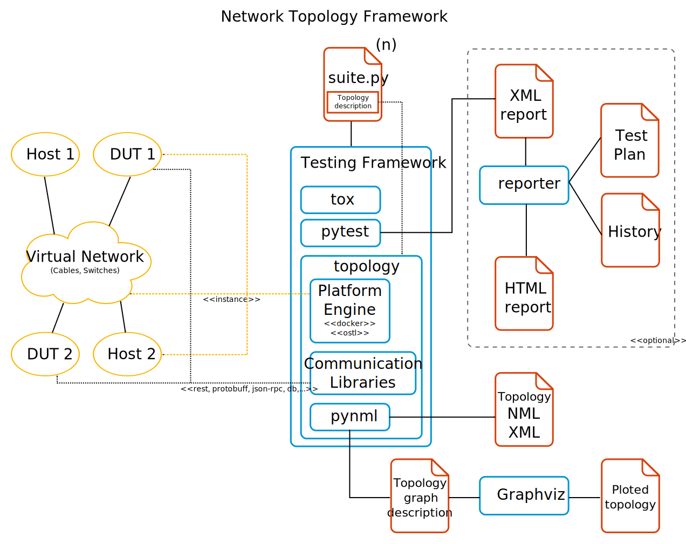

.. toctree::

==============================
Topology Architecture Overview
==============================

Design Principles
=================

The topology framework was built with the following design principles in mind:

#. Standard internal representation of the topology using NML_.
#. The framework must delegate to a plugin, a *Platform Engine*, the
   responsibility to build the topology from the description, using a standard
   interface (:class:`topology.platforms.platform.BasePlatform`) and
   :ref:`process <engine-platform-worflow>`.
#. The *Platform Engine* will return an *Engine Node* that implements an
   standard interface (:class:`topology.platforms.node.BaseNode`) for the user
   to interact with.
#. Nodes, ports and links support undetermined attributes or *metadata*, it is
   up to the *Platform Engine* to interpret and determine what metadata to use
   and how.
#. The *Engine Nodes* implement a base communication interface for *shells*.
   A shell is a command line driven textual interface.
#. Optionally, a *Platform Engine* can support *Communication Libraries* for
   their *Engine Nodes*, which is a
   :ref:`extensible <provide-a-new-communication-library>` way to provide the
   communication mediums to interface with a node
   (RESTful API, Protobuffs, JSON-RPC, Shell parsing libraries, etc).
#. The framework is independent of the platform, the communication mediums, the
   test suite, reporting Software and any other hardwired limitation.
   Nevertheless, support for the pytest suite is built-it.
#. Quality, maintainability, good practices and standards compliance above all:

   - Full PEP8 compliance.
   - Complete test suite and coverage.
   - Complete internal documentation.
   - Extensive external documentation.
   - Bilingual: Python 2.7 and Python 3.4 compatibility.

.. _NML: https://pynml.readthedocs.org/
